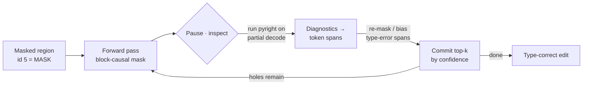

<h1 align="center">Manifold</h1>

<p align="center">
  <strong>A local, type-aware <em>diffusion</em> code editor.</strong><br>
  Whole-region code edits with an on-device diffusion LLM, steered toward
  type-correctness by a type checker <em>inside</em> the denoising loop.
</p>

<p align="center">
  <a href="https://github.com/atatess/manifold/actions/workflows/tests.yml"></a>
  
  
  
</p>

---

## The idea

Autoregressive assistants (Copilot and friends) are great at left-to-right
completion and weak at *"rewrite this whole region under a constraint while
preserving the signature."* That is a **constrained denoising** problem — what
diffusion language models are good at.

Manifold leans into that, and adds the piece nobody ships: it **closes a
feedback loop between a type checker and the diffusion sampler.** Between
denoising steps, it runs the type checker on the partial code and uses the
diagnostics to decide what to re-mask and re-write next. The model denoises
*toward type-correctness* instead of being linted after the fact.

Three properties, combined — and as of mid-2026 no shipping product combines all three:

1. **Local / on-device.** Runs on Apple Silicon via MLX. No cloud inference — works in airplane mode.
2. **Type-aware denoising.** Type-checker feedback is injected *between* denoising steps, not as a post-hoc pass.
3. **Multi-region, cross-file.** Joint denoising over several highlighted spans at once.

> Model: [`ByteDance-Seed/Stable-DiffCoder-8B-Instruct`](https://huggingface.co/ByteDance-Seed/Stable-DiffCoder-8B-Instruct) (MIT, block diffusion), 4-bit MLX weights (~4.6 GB) — measured on an M2 Max at **~4.7 GB resident, ~2 s to load, ~200 ms per forward pass**.

## It works today

The controllable denoising loop runs end-to-end on-device and streams its partial
output every step. Because the loop exposes a hook *between* steps, an
intervention demonstrably steers the real model. Ban the `%` token mid-denoise
and it reroutes to a different, still-correct implementation:

```text
prompt:  "Write a Python function is_even(n) that returns True if n is even."

denoise (no intervention):     return n % 2 == 0
denoise (ban "%" mid-loop):    return n // 2 == n / 2     ← rerouted, still correct
```

That same hook is where type-checker feedback plugs in (Phase 2).

## How it works

Stable-DiffCoder generates **block-by-block**: the edit region is a run of
`<[MASK_TOKEN]>` tokens, and each block is refined over several denoising steps,
committing the highest-confidence positions first. Attention is *block-causal*
(bidirectional within a block, causal across blocks). Manifold reimplements this
reverse-diffusion loop so it can **pause between steps, read the partial code,
and intervene** — which is exactly where the type checker goes.



The forward pass is an **injected dependency**, so the loop is runtime-agnostic
and unit-tested against a fake model — and the type-feedback policy is just one
implementation of the step hook, never a separate lint pass.

## Architecture

Two processes (the second arrives at Phase 3):

- **Model server (Python)** — loads the model, runs the custom denoising loop
  with step-level hooks, and runs the type checker between steps. All model
  logic lives here.
- **VS Code extension (TypeScript)** — UI only: select region(s), type an
  instruction, stream the live denoise into a preview, accept/reject a diff.
  Talks to the server over stdio JSON-RPC. *(Not built yet.)*

## Status & roadmap

| Phase | What | State |
|------:|------|:-----:|
| **0** | Runnable MLX forward over a masked snippet | ✅ done |
| **1** | Controllable block-diffusion loop (pause / inspect / intervene) | ✅ done |
| 2 | pyright **in the loop** (the core demo) | next |
| 3 | VS Code extension (stdio JSON-RPC) | planned |
| 4 | Multi-region / cross-file joint denoise | planned |

Phases 0–1 are covered by a green test suite. The denoising loop, mask builder,
and unmask schedule are validated with an **injected fake forward** (so the full
control surface — pause, inspect, and the `forbid` / `bias` / `re-mask` levers —
is verified independently of the model), and the MLX mask-threading is validated
on a tiny random-weight model.

## Quickstart

```bash
# Apple Silicon (M-series), ~5 GB free for weights
uv sync --extra dev
uv run pytest                       # 30 tests, no model needed

hf download hunterbown/Stable-DiffCoder-8B-Instruct-mlx-4Bit \
  --local-dir models/stable-diffcoder-4bit       # ~4.6 GB, one-time

uv run python scripts/phase0_forward.py          # forward-pass sanity (latency, finite logits)
uv run python scripts/phase1_denoise.py          # streaming denoise
uv run python scripts/phase1_denoise.py --ban " %"   # the intervention demo above
```

## Layout

```
src/manifold/
  masks.py       block-causal additive attention mask          (pure, tested)
  schedule.py    per-step transfer counts + confidence select  (pure, tested)
  sampler.py     the controllable denoising loop                (runtime-agnostic, tested)
  model_mlx.py   MLX forward backend (threads a custom mask)
  typecheck.py   Phase 2 — pyright in the loop  (stub)
  rpc.py         Phase 3 — stdio JSON-RPC       (stub)
scripts/         Phase 0 / Phase 1 runners
tests/           pytest suite
docs/plans/      design
extension/       Phase 3 placeholder (thin TS client)
```

See [`docs/plans/2026-07-01-manifold-design.md`](docs/plans/2026-07-01-manifold-design.md)
for the full design and the engineering decisions behind it.

## License

MIT — see [LICENSE](LICENSE). Stable-DiffCoder and its weights are MIT-licensed
by ByteDance Seed.
